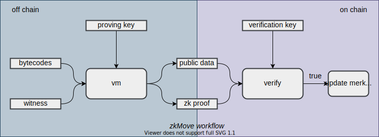

## zkMove：一个基于零知识证明的智能合约运行环境

| Author      | Version    | Date        |
| ----------- | ---------- | ----------- |
| Guangyu Zhu | Draft v0.1 | Jul.7.2021  |
| Guangyu Zhu | Draft v0.2 | Dec.10.2021 |

#### 1.背景

随着 Defi 的繁荣以及非金融类智能合约的出现，以 Ethereum 为代表的公链的可扩展性正受到越来越大的挑战。虽然 POS、分片等技术可以在一定程度上提升吞吐率，但是从长远来看，拥堵的根源依然存在。因为任一交易想要上链，都需要全网大多数节点验证其合法性，而验证的方法就是重复执行该交易。随着应用数量的指数级增长，以及智能合约的逻辑越来越复杂，验证其合法性所耗费的计算资源也会以指数级增加，表现出来就是交易的拥堵和高昂的手续费。

#### 2.设计思想

> 通过零知识证明技术提升可扩展性：

为了从根本上提升区块链的可扩展性，我们提出了 zkMove —— 一个基于零知识证明的智能合约运行环境，它把最安全的智能合约编程语言 Move [1] 和逐渐成熟的零知识证明技术 PLONK [2] 相结合，将计算从链上 “Move” 到链下，在保证安全的同时，大幅提升区块链的可扩展性。

> 通过零知识证明虚拟机提升可编程性：

目前以太坊上采用零知识证明的项目包括 Loopring、ZKSwap等，都只支持单个应用场景，不具备可编程性，每部署一个合约都需要单独编写电路（circuit ）。zkSync [3]、StarkNet [4] 的设计目标是提供通用的扩展方案，它们的多应用场景还在开发当中。zkMove 希望能将多年来在编程语言虚拟机领域的积累和零知识证明密码学结合在一起，打造一个图灵完备的零知识证明虚拟机，使智能合约可以通过虚拟机直接部署，不用单独开发电路。

> 通过 Move 语言提供超越区块链的安全性：

首先，通过零知识证明技术继承区块链的安全性。有了 zkMove 做基础，很容易在主链上构建各种 Layer2 解决方案，用户不必时刻监控网络，任何人或者机构都无法盗取用户资金或者破坏用户状态，任何时刻用户都可以无条件提取资产。其次，通过 Move 语言超越主链安全性。zkMove 采用新一代面向数字资产的 Move 智能合约编程语言，结合形式化验证等工具，可以进一步增强智能合约的安全性。

> 成为跨区块链的智能合约运行环境：

不同于已有的 Layer2 方案，zkMove 不是将自己定位为某条公链的 Layer2，而是定位为一个跨区块链的智能合约运行环境。运行在 zkMove 上的智能合约可以直接跟另一个运行在 zkMove 上的智能合约进行交互，无论底层是哪条区块链，或者甚至是底层不依赖区块链。

#### 3.工作原理

从分布式计算的角度，区块链是一个复制状态机（replicated state machine），其中 S 表示当前的账户状态，当交易 txn 被执行后账户状态变更为 S'：

为了将计算从链上 “Move” 到链下，需要将账户状态 S 搬到链下，用默克尔树来维护，用户交易的签名校验、执行都在链下进行。只有当用户需要时才将其账户状态同步到链上，否则仅将状态的默克尔树根 R 上链，状态的正确性通过参与交易的账户的 merkle_proof 来保证。这一过程用复制状态机可以表示为：

为了将计算从链上 “Move” 到链下，还需要将用户交易按提交顺序在链下执行，并生成零知识证明 zk proof​ 和压缩编码后的操作记录，然后将运行结果和 zk proof 提交到链上。链上的智能合约对 zk proof 进行验证，验证通过则说明用户的交易确实被正确执行了，然后记录最新的默克尔树根 R'。压缩后的操作记录作为智能合约的参数上链，作为用户交易记录。

上图描述了 zkMove 典型的工作流程。它的核心是一个字节码虚拟机，bytecode 满足 Move 字节码规范。 Move 作为新一代面向数字资产的智能合约编程语言，它的安全性、形式化验证等特性基本满足 zkMove 的要求。witness 是交易的输入，它通常包含参与交易的 accounts、merkle\_proof 和执行交易前的状态树树根 R；public data 是交易的输出，它通常包含执行交易后新生成的状态树树根 R' 和压缩后的用户操作记录。zkMove 采用了只需要一次可信初始设置的PLONK 零知识证明算法，智能合约在发布的时候生成 proving key 和 verification key。

#### 4.项目进展

截止本文档 draft v0.2 发布时，我们已经完成了 zkMove 零知识证明虚拟机 zkMove Core第一阶段 POC 工作，非图灵完备的 Move 智能合约已经可以正常生成和验证 zk proof。下一阶段，我们将会在完善已有功能的同时实现图灵完备，后续将会有更详细的信息分享。

#### 5.参考文献

[1] Sam Blackshear, Evan Cheng, David L. Dill, Victor Gao, Ben Maurer, Todd Nowacki, Alistair Pott, Shaz Qadeer, Rain, Dario Russi, Stephane Sezer, Tim Zakian, Runtian Zhou [*Move: A Language With Programmable Resources*](https://diem-developers-components.netlify.app/papers/diem-move-a-language-with-programmable-resources/2020-05-26.pdf)

[2] Ariel Gabizon, Zachary J. Williamson and Oana Ciobotaru [*PLONK: Permutations over Lagrange-bases for Oecumenical Noninteractive arguments of Knowledge*](https://eprint.iacr.org/2019/953)

[3] Alex Gluchowski [*Introduction to zkSync*](https://medium.com/matter-labs/introduction-to-zksync-16f3753ac96c)

[4] Eli Ben-Sasson, Iddo Bentov, Yinon Horesh and Michael Riabzev [*Scalable, transparent, and post-quantum secure computational integrity*](https://eprint.iacr.org/2018/046)

